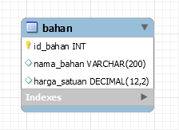

# Tugas Besar 2 IF3110 Pembelajaran Aplikasi Berbasis Web
# WS-Supplier

## Deskripsi Web Service
Web Service Supplier diimplementasikan di atas Node.js dengan mengimplementasikan protokol REST. Web service ini bertanggung jawab atas pembelian bahan-bahan coklat serta pendaftaran bahan-bahan coklat yang mampu dibeli.

Layanan yang disediakan:
1. Melakukan transaksi bahan dengan Willy Wangky's Factory.
Apabila uang cukup, Web Service memberikan respon jumlah uang hasil transaksi beserta status berhasil.
Apabila uang tidak cukup, Web Service memberikan respon jumlah uang yang kurang agar transaksi berhasil beserta status gagal.

2. Memberikan daftar bahan yang dijual.
Web service menerima request dari Willy Wangky's Factory dan mengembalikan data berisi daftar bahan-bahan yang ada dan harga satuannya.

## Basis data

### Tabel

| Nomor | Relasi | Penjelasan                                                                                     |
|-------|--------|------------------------------------------------------------------------------------------------|
| 1     | bahan  | Relasi ini berisi data bahan yang dijual yang terdiri dari ID bahan dan harga satuan.          |